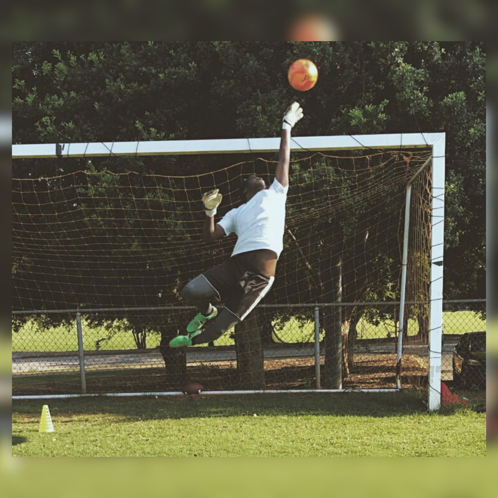
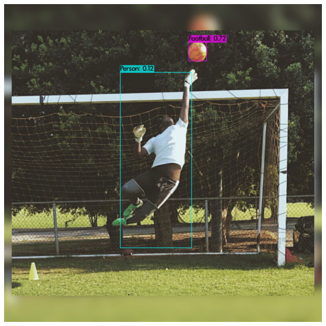
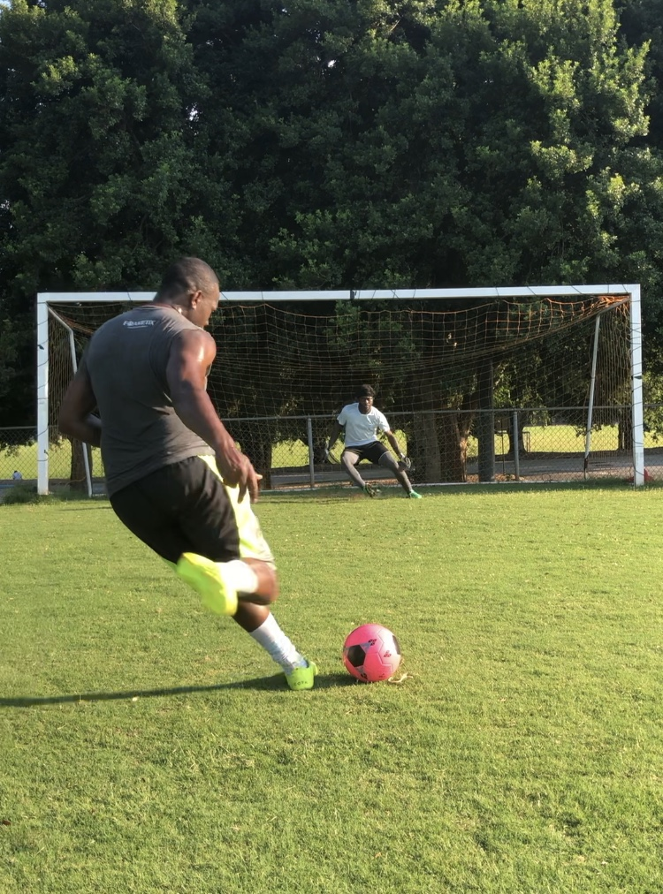
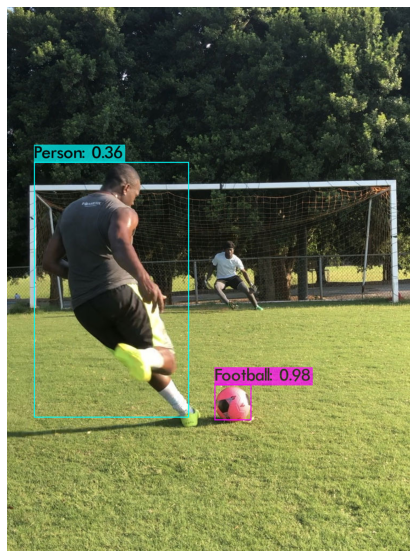

# soccer-game-scene-object-detection
 Using YOLOv3 for detecting popular objects in a soccer game scene

## Goal
A soccer game scence object detector using training data from Google’s Open Images Dataset (Open images V6).
Objects to be detected: 
- Football
- Footwear
- Person
- Glove
- Human face

## Method (In short)
Reference for methods: __[[Link]](https://www.youtube.com/watch?v=10joRJt39Ns&t=1376s)__
- Pulled images from Open Images via OIDv4 toolkit
   - Collected 300 images and annotations for each class of object
- Training in darknet framework
- Configurations for Training
   - Batch = 64
   - Classes = 5
   - Max_batches = 10000 (2000 X no of classes used for training)
   - Steps = 8000, 9000 (80% and 90% of iteration)
   - Filters (no of class + 5) X 3 = 30
- Transfer learning protocols
   - Pre-trained weights from darknet53.conv.74: trained on coco datasets
- Training  
   - On google colab GPU for 15 hours
   
## Results (In short)

### Average loss: 0.72  

**Test Picture 1: Sancho**  
Input: 

Output: 

**Test Picture 2: GitHub repo author**  
Input: 

Output: 

**Test Picture 3: Lenny + GitHub repo author**  
Input: 

Output: 

